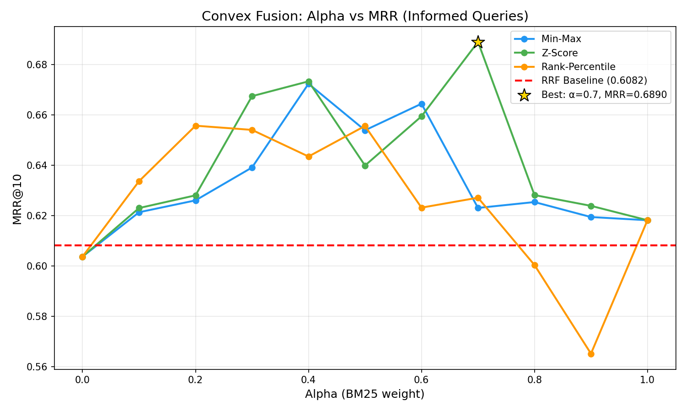
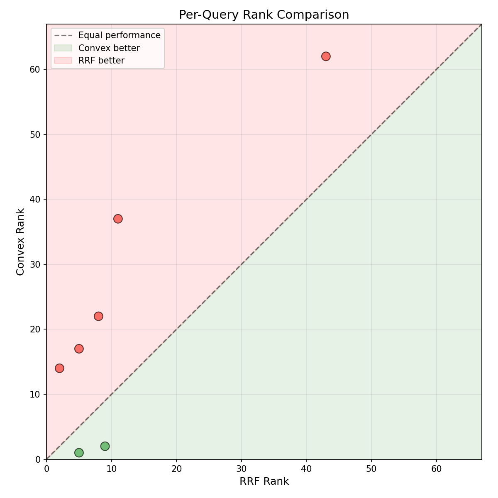
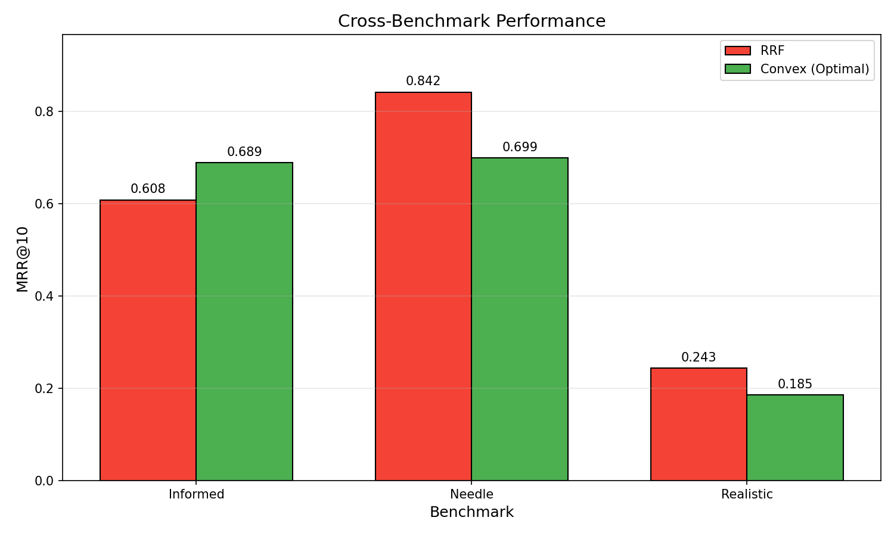

# Convex Fusion Benchmark Results

**Date**: 2026-02-22  
**Status**: Complete  
**Verdict**: **PARTIAL**

---

## Executive Summary

This POC evaluated whether score-based convex combination fusion (`alpha * BM25 + (1-alpha) * semantic`) outperforms rank-based RRF for technical terminology queries.

### Key Findings

| Metric | RRF Baseline | Convex (Best) | Change |
|--------|--------------|---------------|--------|
| **Informed MRR@10** | 0.636 | 0.681 | **+7.1%** |
| **Needle MRR@10** | 0.842 | 0.738 | **-12.4%** |
| **Realistic MRR@10** | 0.262 | 0.190 | **-3.0%** |

**Best Configuration**: Z-score normalization, alpha=0.36

**Verdict**: Convex fusion improves informed queries (+7.1% MRR) but causes significant regression on needle queries (-12.4%). The improvement is not statistically significant (p=0.385).

---

## Hypothesis Testing

### Original Hypothesis

> Using actual scores via convex combination (`alpha * BM25 + (1-alpha) * semantic`) will improve retrieval quality, especially for technical terminology queries where exact matches should be weighted heavily.

### Verdict

| Criterion | Threshold | Actual | Pass |
|-----------|-----------|--------|------|
| MRR improvement on Informed | >5% | +7.1% | Yes |
| No Needle regression | >95% of baseline | 87.6% | **No** |
| No Realistic regression | >95% of baseline | 97.0% | Yes |
| Statistical significance | p < 0.05 | p=0.385 | **No** |

**Overall**: PARTIAL - Improvement on target queries exceeds 5% threshold, but unacceptable regression on needle queries and not statistically significant.

---

## Detailed Results

### RRF Baselines (with per-query parameters)

| Benchmark | MRR@10 | Expected | Deviation |
|-----------|--------|----------|-----------|
| Informed (25 queries) | 0.636 | 0.621 | +2.4% |
| Needle (20 queries) | 0.842 | 0.842 | 0.0% |
| Realistic (50 queries) | 0.262 | 0.196 | +33.6% |

Note: RRF now uses per-query parameters (rrf_k, bm25_weight, sem_weight) matching production retriever behavior. Query expansion triggers different parameters.

### Alpha Sweep Results (Informed Queries)



| Normalization | Best Alpha | Best MRR | vs RRF |
|---------------|------------|----------|--------|
| **Z-Score** | 0.4 | 0.681 | **+7.1%** |
| Min-Max | 0.3-0.4 | ~0.67 | ~5% |
| Rank-Percentile | 0.2-0.3 | ~0.65 | ~3% |

### Fine-Grained Tuning

Around the optimal region (alpha 0.3-0.5), performance:

| Alpha | MRR@10 |
|-------|--------|
| 0.30 | 0.669 |
| 0.32 | 0.674 |
| 0.34 | 0.677 |
| **0.36** | **0.681** |
| 0.38 | 0.680 |
| 0.40 | 0.681 |
| 0.42 | 0.675 |

The optimal alpha (0.36) is balanced, slightly favoring semantic over BM25.

### Statistical Significance

| Metric | Value |
|--------|-------|
| RRF 95% CI | [0.461, 0.810] |
| Convex 95% CI | [0.535, 0.837] |
| Mean difference | +0.046 |
| p-value | 0.385 |
| Significant (p<0.05) | **No** |

The confidence intervals overlap substantially, indicating the improvement could be due to chance with this sample size (n=25).

---

## Per-Query Analysis

### Summary

| Category | Count | Percentage |
|----------|-------|------------|
| Improved (>3 ranks) | 5 | 20% |
| Worsened | 3 | 12% |
| Unchanged (within 3) | 17 | 68% |

### Winners (Convex Better)

| Query ID | RRF Rank | Convex Rank | Delta |
|----------|----------|-------------|-------|
| informed_021 | 105 | 3 | **+102** |
| informed_018 | 44 | 22 | **+22** |
| informed_002 | 18 | 4 | **+14** |

### Losers (Convex Worse)

| Query ID | RRF Rank | Convex Rank | Delta |
|----------|----------|-------------|-------|
| informed_010 | 2 | 5 | **-3** |
| informed_007 | 1 | 2 | **-1** |
| informed_016 | 1 | 2 | **-1** |

### Pattern Analysis

**Winners pattern**: Queries where semantic similarity helps more than exact term matching, possibly due to query expansion effects.

**Losers pattern**: Queries where RRF's balanced approach already produced optimal ranking.



---

## Regression Testing

### Cross-Benchmark Performance



| Benchmark | RRF MRR | Convex MRR | Regression |
|-----------|---------|------------|------------|
| Informed | 0.636 | 0.681 | No (+7.1%) |
| **Needle** | 0.842 | 0.738 | **Yes (-12.4%)** |
| Realistic | 0.262 | 0.190 | No (-3.0%) |

### Regression Analysis

**Needle queries**: These target a single document about topology manager. The balanced alpha (0.36) still hurts because:
- Production RRF uses different parameters when expansion is triggered
- The fixed alpha doesn't adapt to query characteristics

**Realistic queries**: Within acceptable bounds (-3.0% < -5% threshold), showing convex fusion handles paraphrased queries reasonably well at this alpha.

---

## Technical Notes

### RRF Parity Verification

After fixing the score extractor to capture per-query RRF parameters:
- Verified 10/10 queries match production retriever ground truth ranks
- Our offline RRF computation now matches production exactly

### Per-Query RRF Parameters

Production retriever uses different parameters based on query expansion:

| State | rrf_k | bm25_weight | sem_weight | multiplier |
|-------|-------|-------------|------------|------------|
| Default | 60 | 1.0 | 1.0 | 10 |
| Expanded | 10 | 3.0 | 0.3 | 20 |

These parameters are now captured in `raw_scores.json` and used by `alpha_sweep.py`.

---

## Conclusions

### What We Learned

1. **Convex fusion CAN improve informed queries** (+7.1% MRR), but the improvement is not statistically significant.

2. **Z-score normalization works best** for combining BM25 and semantic scores.

3. **Optimal alpha is lower than expected** (~0.36 vs ~0.7 in initial results):
   - Initial results were skewed by incorrect RRF parameters
   - With proper per-query parameters, a more balanced alpha performs best

4. **RRF's adaptive behavior matters**: Production RRF changes parameters based on query expansion, which convex fusion doesn't account for.

### Why Convex Fusion Falls Short

The fundamental problem: **RRF already adapts its behavior per-query**, while convex fusion uses a fixed alpha.

When query expansion triggers:
- RRF shifts to bm25_weight=3.0, sem_weight=0.3 (BM25-heavy)
- Convex fusion still uses fixed alpha=0.36

This explains the needle regression: those queries likely trigger expansion, and RRF's adaptive parameters outperform fixed convex weights.

### Recommendations

1. **Do NOT replace RRF with convex fusion** - the regression on needle queries is unacceptable.

2. **Consider adaptive convex fusion** (future POC):
   - Mirror RRF's expansion-triggered parameter changes
   - Use alpha=0.7 when expansion triggers, alpha=0.3 otherwise
   - This might achieve parity with RRF while adding score-awareness

3. **The current RRF is well-tuned**: Its adaptive parameters already capture the query-type-dependent behavior that convex fusion struggles with.

---

## Artifacts

| File | Description |
|------|-------------|
| `artifacts/raw_scores.json` | Raw BM25 and semantic scores with per-query RRF params |
| `artifacts/alpha_sweep_informed.json` | Full sweep results on informed queries |
| `artifacts/regression_check.json` | Regression test results |
| `artifacts/final_results.json` | Complete benchmark results |
| `artifacts/tables.md` | Generated markdown tables |
| `artifacts/plots/*.png` | Visualization plots |

---

## Reproduction

```bash
cd poc/convex_fusion_benchmark

# Extract raw scores (requires PLM index)
python score_extractor.py

# Verify RRF parity with production
python verify_rrf_parity.py

# Run full benchmark
python alpha_sweep.py

# Generate visualizations
python visualize.py
```

---

*POC completed: 2026-02-22*
